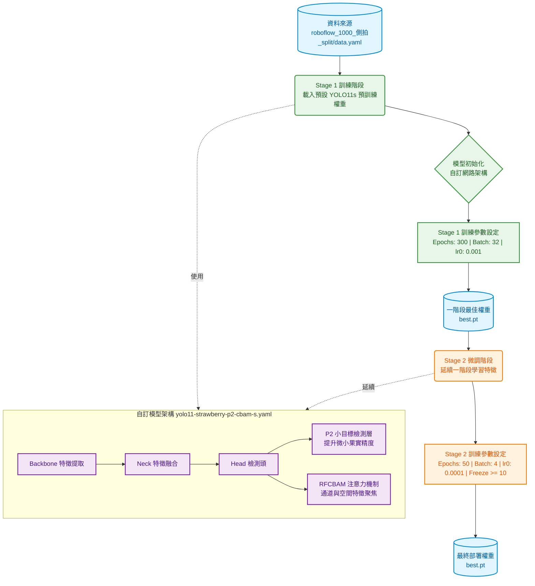

# 兩階段微調架構圖

這個 notebook 的重點是：

- 先用自訂架構 `yolo11-strawberry-p2-cbam-s.yaml` 進行 **Stage 1** 訓練
- 再用 Stage 1 的 `best.pt` 做 **Stage 2** 微調
- 當前最急需的任務是：用 Stage 1 模型檢查資料集標註是否正確

## 重點說明

### 1. Stage 1 的目的
- 先建立並驗證自訂模型是否能順利啟動。
- 檢查資料集標註品質：是否有漏標、誤標、錯類別、數據偏差。
- 輸出 `runs/detect/train*/weights/best.pt`，作為後續 Stage 2 的基礎。

### 2. Stage 2 的定位
- Stage 2 不是重新換模型，而是延續 Stage 1 的 `best.pt`。
- 目的是用更低學習率、部分凍結、細調超參數來提升表現。
- 只有在資料集確認無重大標註錯誤後再執行。

### 3. 檢查重點
- `Stage 1` 是否使用到 `yolo11-strawberry-p2-cbam-s.yaml` 與 `yolo11s.pt`
- `CBAM x4` 是否實際被建立並注入模型
- `Stage 1` 訓練參數是否為目前 ultralytics 版本支援
- `Stage 2` 是否讀取 Stage 1 的 `best.pt`
- `Stage 2` 是否保持相同架構，而不是換成新模型

### 4. 目前建議流程
1. 先執行 Stage 1，快速取得 Stage 1 模型。
2. 觀察 Stage 1 loss 與 mAP，找出可能的標註異常。
3. 修正資料後，再執行 Stage 2 微調。

---

## 為什麼這樣安排？
- 目前最急需的是資料品質檢查，而不是直接追最終微調結果。
- Stage 1 的模型結果能直接反映資料集問題，是最適合的檢查工具。
- Stage 2 應該放在資料集確認後，避免把錯誤資料放到更深的 fine-tune 階段。
